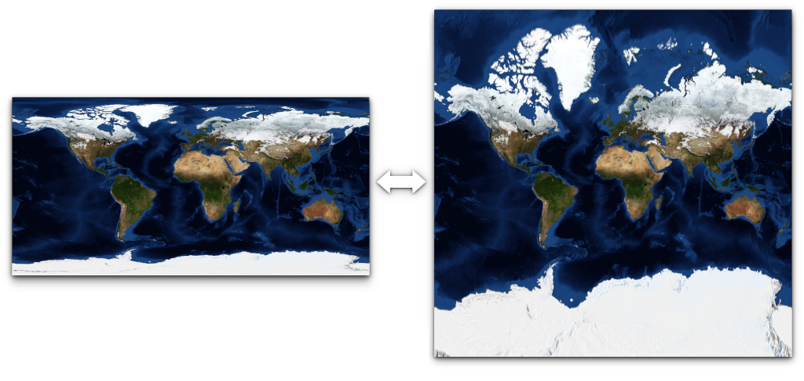

# Equirectangular-Mercator Projection Converter

Bi-directional image projection converter. Converts images between equirectangular and mercator projections.

Features a fast GPU and a slower CPU conversion implementations:

- The GPU version uses [moderngl](https://github.com/moderngl/moderngl) to transform the image using shaders and then saves it using Pillow
- The CPU version simply uses [Pillow](https://github.com/python-pillow/Pillow) to modify every pixel individually

This project therefore contains working examples of Python and GLSL conversion code. Feel free to borrow them and translate them to your language/project.

## Setup

1. Install [Python 3.11+](https://www.python.org/downloads/)
1. [Clone the repository](https://docs.github.com/en/repositories/creating-and-managing-repositories/cloning-a-repository)
1. Install requirements
```
pip install -r requirements.txt
```

## Usage

### CLI

```shell
python convert.py path/to/input_image [--to_equirectangular] [--to_mercator] [--nearest] [--cpu]
```

| Parameter |  |
| --- | --- |
| &#8209;&#8209;to_equirectangular | Convert the image to the Equirectangular projection. |
| --to_mercator | Convert the image to the Mercator projection. |
| --nearest | Use nearest sampling for stretching that will occur due to change of aspect ratio. Only used by GPU rendering. |
| --cpu | Use the CPU rendering implementation. Much slower and doesn't support linear sampling. |

#### Examples

```shell
# Merc to equi
python convert.py merc.png --to_equirectangular

# Equi to merc
python convert.py equi.png --to_mercator
```

### Python API

You can use the Converter class directly in Python. Check out the [test script](test.py) to see how to run conversions from code.

## Size limits

Input images have the following size limits:

- GPU (Default)
  - To Mercator: 32768 x 16384
  - To Equirectangular: 16384 x 32768
  - Exceeding these limits will result in `Error: the framebuffer is not complete (INCOMPLETE_ATTACHMENT)`
- CPU
  - CPU conversion seems to be mainly limited by available system memory, but other limits in Pillow are also present: https://pillow.readthedocs.io/en/stable/reference/limits.html

## Python package

If anyone wants to transform this into a functional, publishable package, feel free to fork the project and publish it. I don't have enough experience doing that and can't imagine many people will use this thing to make the extra effort worthwhile.

## Image sources

- https://en.wikipedia.org/wiki/File:Equirectangular-projection.jpg
- https://en.wikipedia.org/wiki/File:Mercator-projection.jpg